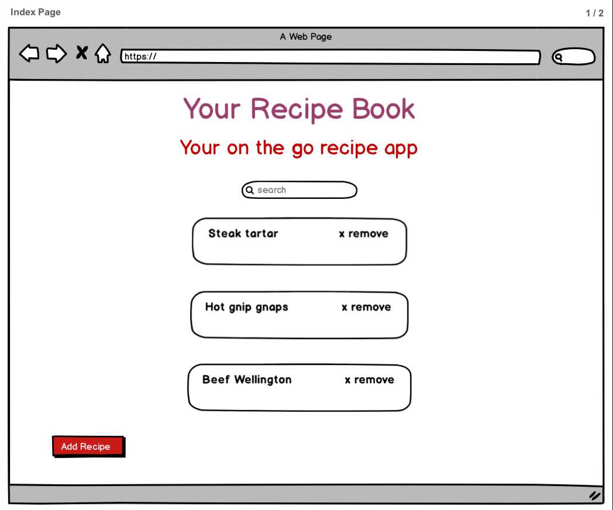
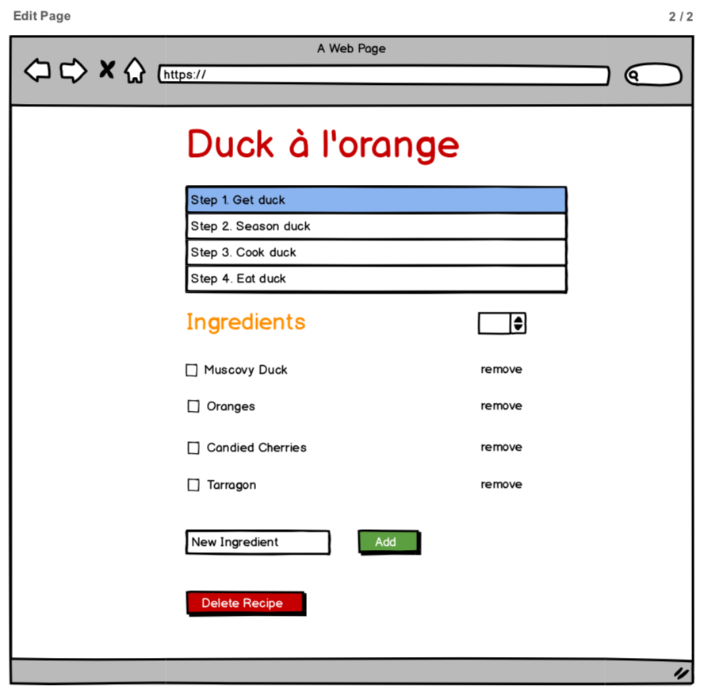
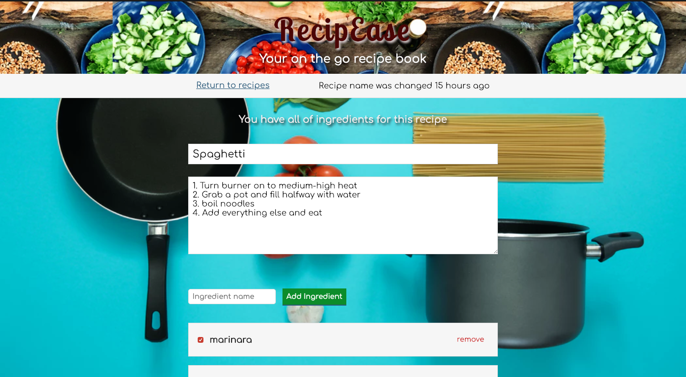
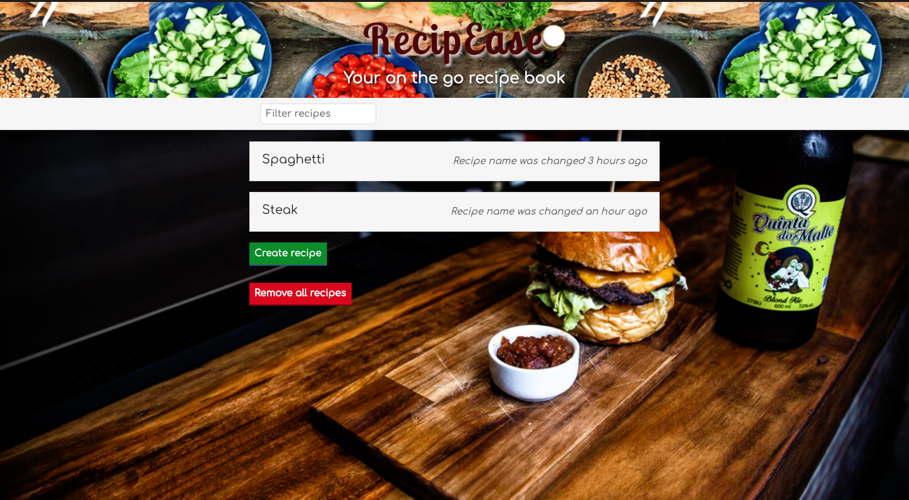
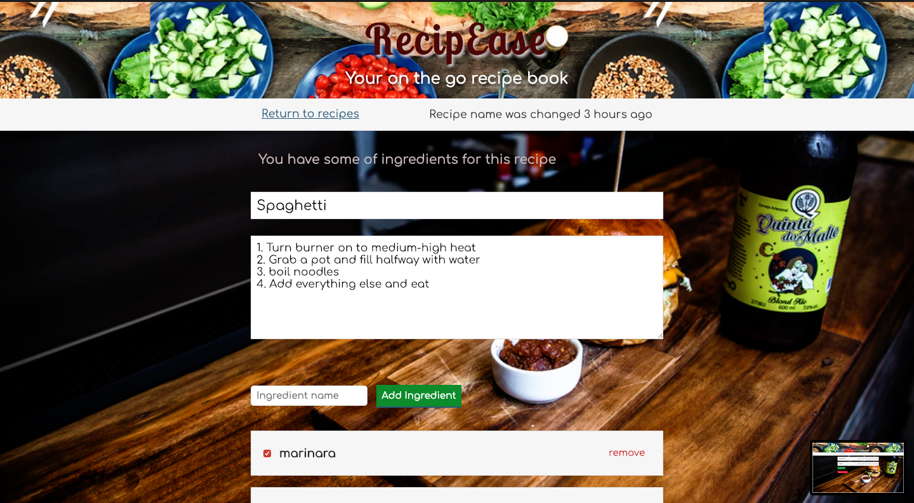

# RecipeEase

This project was a challenge idea after completing Andrew Mead's Modern JavaScript tutorial.

We first created a guided Hangman app then moved on to Notes and Todos apps where Andrew went through JavaScript fundamentals and added ES6 and some ES7 concepts. All the while, we were challenged to complete significant parts of the todos app on our own.

At the end of the course, Andrew challenged students to complete an app from what they learned in the course, with absolutely no guidance. This is all done by the student. The challenge was to create a recipe app which combined what we learned from the course.

So here it is! RecipeEase! The app uses modern JavaScript OOP along with Babel and Webpack. 

To run the project locally, clone it, unzip and run "npm start". 

**Concept drawings using Balsamiq**

