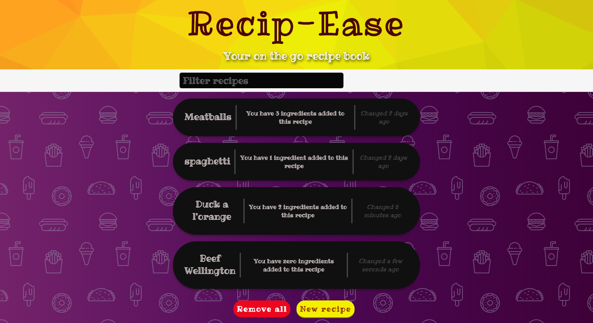

# RecipeEase

[View Live](https://recipe-easy.firebaseapp.com/index.html)

Here it is! RecipeEase! The app uses modern JavaScript OOP along with Babel and Webpack. 

To run the project locally, clone it, unzip it and type "npm run dev-server" in the terminal. 

The project is hosted on Firebase.

**Concept drawings using Balsamiq**

